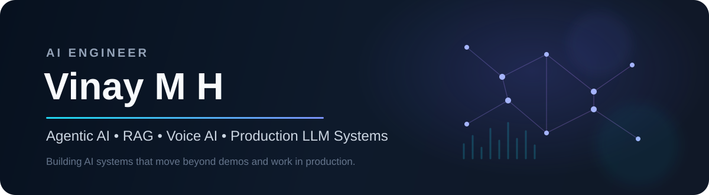

 

## 👋 About me

I'm an **AI Engineer** focused on building practical, production-grade AI systems across **agentic workflows, retrieval-augmented generation, multilingual voice AI, and NLP**.

I work across the full lifecycle — **problem framing → prototyping → evaluation → APIs → orchestration → deployment → monitoring** — with a strong interest in systems that are reliable enough to operate outside a demo environment.

<table>
<tr>
<td width="25%" align="center"><strong>20L+</strong> Voice AI calls</td>
<td width="25%" align="center"><strong>5</strong> Languages deployed</td>
<td width="25%" align="center"><strong>100K+</strong> NLP records analyzed</td>
<td width="25%" align="center"><strong>Production</strong> RAG & agent workflows</td>
</tr>
</table>

## 🧠 What I build

| Area | What I work on |
|---|---|
| 🤖 **Agentic AI** | Tool calling, multi-agent orchestration, stateful workflows, retries, failure handling |
| 🔎 **RAG** | Embeddings, hybrid retrieval, vector search, reranking, grounding, evaluation |
| 🎙️ **Voice AI** | Multilingual agents, STT/TTS, telephony, prompt design, structured extraction |
| 🧪 **LLM Engineering** | Evals, guardrails, prompt iteration, model integration, observability |
| 📊 **NLP** | Topic modelling, clustering, sentiment, embeddings, large-scale text pipelines |
| ⚙️ **AI Backend** | FastAPI, webhooks, async workflows, databases, Docker, cloud deployment |

## 🛠️ Tech stack

**Core Engineering**

  

**LLM / GenAI**

**Voice / NLP**

## 🚀 Selected work

### 🔎 [DocuQueryAI using Groq](https://github.com/vinaymh-ai/DocuQueryAI-usingGroq)
A document intelligence / RAG project focused on fast question answering over user-provided content.

**Shows:** RAG · Groq · LLM integration · document retrieval

### 🧰 [AI Starter Kit](https://github.com/vinaymh-ai/ai-starter-kit)
Reusable experiments and components for building and testing AI applications quickly.

**Shows:** AI engineering · prototyping · reusable components · experimentation

### 🎙️ Multilingual Voice AI Platform
Designed production voice-agent workflows across **English, Hindi, Tamil, Marathi, and Bengali**, integrating telephony providers, retries, webhooks, structured outputs, and analytics.

**Shows:** Voice AI · orchestration · STT/TTS · telephony · production scaling

### 📊 Topic & Sentiment Intelligence
Built large-scale NLP pipelines using **BERTopic, Sentence Transformers, UMAP, HDBSCAN, and LLM-assisted enrichment**.

**Shows:** NLP · embeddings · clustering · topic modelling · scalable text analysis

> More case studies and project details are available on my **[portfolio](https://vinaymh-ai.github.io/vinaymh.github.io/)**.

## 🔬 Current focus

- Multi-agent architecture & coordination
- Tool calling and agent orchestration
- RAG evaluation and retrieval quality
- LLM observability and failure analysis
- Guardrails, golden datasets, and production evals
- Building stronger open-source AI projects

## 📈 GitHub

## 🤝 Let's connect

I'm interested in **AI Engineer, GenAI Engineer, LLM Engineer, and Applied AI** opportunities where I can build and scale real AI products.

---

AI systems • Agentic workflows • RAG • Voice AI • LLM engineering

